1. Встановіть СКБД PostgreSQL, отримавши для вашої ОС інсталяційний пакет з https://www.postgresql.org/download/
2. Створіть термінальну консоль psql через утиліту командного рядка вашої ОС та встановіть з’єднання з БД postgres від імені користувача-адміністратора postgres
3. Зареєструйте нового користувача в СКБД PostgreSQL, назва якого співпадає з вашим прізвищем, наприклад blazhko, і довільним паролем. 

4. Створіть роль в СКБД PostgreSQL (назва співпадає з вашим прізвищем латинськими літерами) і надайте новому користувачеві можливість наслідувати цю роль. 
 
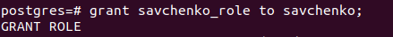
5. Створіть реляційну таблицю з урахуванням варіанту з таблиці 2.1 від імені користувача-адміністратора. 
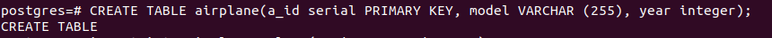
6. Внесіть один рядок в таблицю, використовуючи команду insert into ..., відповідно до варіанту. 

7. Додатково створіть ще одну термінальну консоль psql та та встановіть з’єднання з БД postgres від імені нового користувача.
8. Від імені нового користувача виконайте запит на отримання даних з таблиці (select * from таблиця). Запротоколюйте результат виконання команди. 
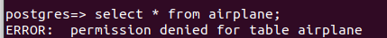
9. Встановіть повноваження на читання таблиці новому користувачеві. 
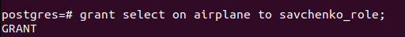
10. Повторіть крок 8. 
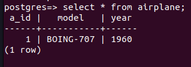
11. Зніміть повноваження на читання таблиці для нового користувача. 
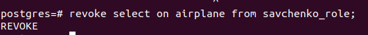
12. Повторіть крок 8. 
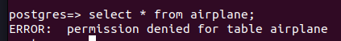
13. Створіть команду оновлення даних таблиці (UPDATE) і виконайте її від імені нового користувача. Проаналізуйте результат виконання команди. 
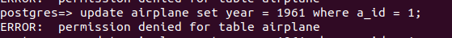
14. Встановіть повноваження на оновлення таблиці новому користувачу. 
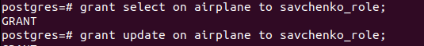
15. Повторіть крок 13. 
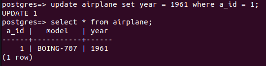
16. Створіть команду видалення запису таблиці (DELETE) і виконайте її від імені нового користувача. Проаналізуйте результат виконання команди. 
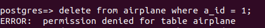
17. Встановіть повноваження на видалення таблиці новому користувачеві. 
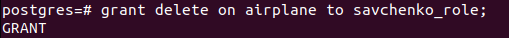
18. Повторіть крок 16. 
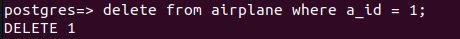
19. Зніміть всі повноваження з таблиці для нового користувача. 
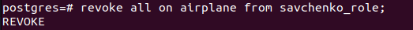
20. Створіть команду внесення запису в таблицю (INSERT) і виконайте її від імені нового користувача. Проаналізуйте результат виконання команди. 
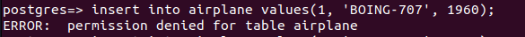
21. Встановіть повноваження на внесення даних до таблиці для ролі. 
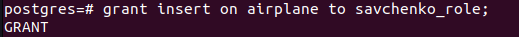
22. Повторіть крок 20. 
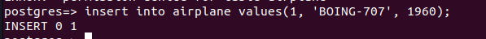