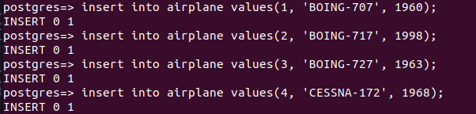

1. Заповніть таблицю БД ще трьома рядками. 

2. Створіть схему даних користувача, назва якої співпадає з назвою користувача, та створіть віртуальну таблицю у цій схемі з правилами вибіркового керування доступом для користувача так, щоб він міг побачити тільки деякі з рядків таблиці з урахуванням одного значення її останнього стовпчика. 
 
 

3. Встановіть з’єднання з СКБД від імені нового користувача
4. Перевірте роботу механізму вибіркового керування, виконавши операцію SELECT до віртуальної таблиці.
5. Створіть INSERT/UPDATE/DELETE-правила обробки операцій редагування віртуальної таблиці.
6. Перевірте роботу механізму вибіркового керування, виконавши операції INSERT, UPDATE, DELETE до віртуальної таблиці. 
