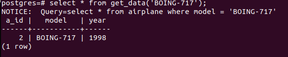
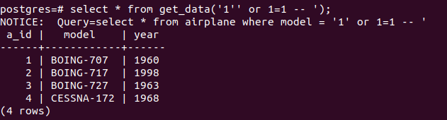
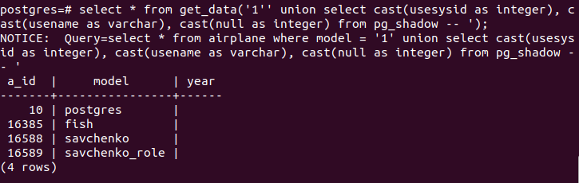
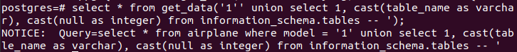
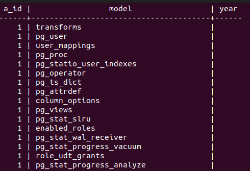

## SQL-ін'єкції порушення конфіденційності 
#### Спосіб виклику функції зі стандартним (очікуваним) значенням параметра 
 
#### SQL-ін'єкція підкласу "Зняття фільтрації рідків умови SQL-запиту" 
 
#### SQL-ін'єкції підкласу "Отримання вмісту таблиць, що не входять у SQL-запит" 
 
#### SQL-ін'єкції підкласу "Отримання структури таблиць БД" 
 
 