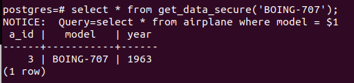

## Робота створених безпечних функцій
### get_data_secure: 
#### Спосіб виклику функції зі стандартним (очікуваним) значенням параметра 
 
#### SQL-ін'єкція 
 
### change_data_secure: 
#### Спосіб виклику функції зі стандартним (очікуваним) значенням параметра 
 
#### SQL-ін'єкція 
 