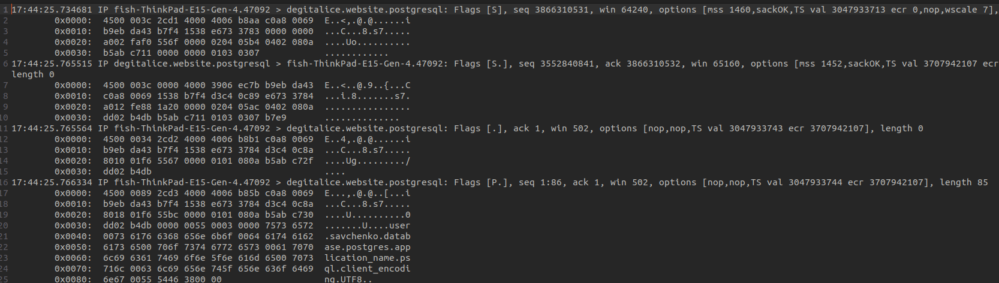

## Проаналізувати вміст перехоплених пакетів та збережених раніше у файлі, наприклад, res.dump. Підтвердити передачу деяких даних у відкритому вигляді.

#### Бачимо наявність даних про ім'я користувача, назву БД і т.д.