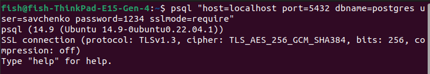

## Використовуючи програму psql, встановити TSL/SSL-з'єднання з БД за прикладом з лабораторної роботи No8, але використовуючи формат параметрів "host=var1 port=var2 dbname=var3 user=var4 password=var5 sslmode=var6". Визначити версію TSL-протоколу та перелік використаних криптоалгоритмів.

#### Версія TSL-протоколу: TLSv1.3
#### Перелік використаних криптоалгоритмів: TLS_AES_256_GCM_SHA384